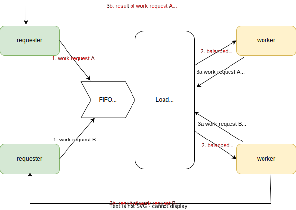

# Concurrent generic load balancer

## Genesis and overview

I was reading about `Go` and was impressed with how it has 3 useful features for concurrent programming:

- `go` routines - lightweight threads
- `channel`s (which are typed)
- `select` statement which is a concurrent control switch - it gives the ability to listen to many channels and wait for any one to be ready to be ready

Concurrency as a design approach seems to be concerned with independently **dealing with** a lot of "things" (functions, processes) at once (i.e. solution structure) as opposed to parallelism **doing** a lot of things at once.

Concurrent design leads to independent processes, so creates the nned for inter-processes communication.

I wanted to investigate how to set up a generic concurrent processing architecture, with as little language specificit as possible. To be concurrent (and not cooperative multitasking), I used the Python `multiprocessing.Process` as this is the simplest "spawn process" functionality rather than `asyncio`, `concurrent.futures` or `multiprocessing.Thread` libraries. `asyncio` and `multiprocessing.Thread` are concerned with I/O bound processes and use cooperative multitasking (essentially an intelligent single thread). `concurrent.futures` uses pool-based multiple processes but I wanted to not use language-dependent pool management to keep the implementation structurally close to the design. Similarly for `multiprocssing.Pool`. The pool is managed by the `Balancer` to enable load-based balancing.

In this architecture, a variable number of `Requester`s send `Requests` to a single `Balancer` via a single FIFO request queue (`multiprocessing.Queue`).

The `Balancer` distributes the incoming requests among a variable number of `Worker`s.

The concurrency is facilitated from a design point of view by:

- the work being load balanced among a number of `Worker`s
- the request containing a "return result" queue which enables the `Worker` carrying out the work to communicate the result of the work directly back to the `Requester`. The `Balancer` simply distributes work, it avoids becoming a bottle-neck/creating performance side-effects by **not becoming involved in the relaying of results**.



The important `Queue`s in the design are (following the flow of processing, same num bers as diagram)

1. `Balancer.request_queue` - the queue owned by the `Balancer`, onto which the `Requester`s send their `Requests`

2. `Worker.worker_request_queue` - the queue, owned by the `Worker` instance, onto which the `Balancer` `put`s work to be done

3a. `Balancer.work_done_queue` - the queue owned by the `Balancer`, passed to the `Worker` instance on creation which enables the worker to communicate back to the `Balancer` work done. This enables (not implemented) the `Balancer` to audit work received = work done.

3b. `Requester.results_queue` - the queue added to the `Request` to enable the `Worker` to communicate the result of the `Request` **directly** back to the `Requester`

## Features of each class

### `Requester`

The process generating the `Request`s is non-proscriptive: The `Request` simply needs to contain a `Callable` and the arguments to pass to that `Callable` (implemented as `*args`). The `Queue` to return results to the `Requester` is also added at the point of submission to the `Balancer`

This means that any number of heterogenous `Requester`s (work creators) can be attached to the `Balancer` with the condition that the function is stateless, first class function.

```python
class Requester:
    """Utility class to generate work to send to the balancer"""

    def __init__(self, requests_queue, manager):
        # The request queue of the balancer receiving the Requests
        self.requests_queue = requests_queue
        # The queue along which this Requester wants to receive resukts of work direct from the Worker
        self.results_queue = manager.Queue()
        # Audit of results received back
        self.results_received = 0
        # Requester id
        self.id = uuid4()

```

### `Request`

A request object contains 3 fundamental properties

- a python `Callable` to execute, the "work"
- `args` the arguments to be passed to the `Callable`
- `results_queue` - the queue owned by the originating process for the `Worker` that executes the `Request` to send the result back to the `Requester`. The `result` of the work is added to the `Request` instance and the whole request is returned to the `Requester`

```python
class Request:
    """request class to transport work function and parameters from the requester
    to the Worker via the Balancer and report result back to Requester
    """

    def __init__(self, results_queue, fn, *args):
        # The Callable to be executed
        self.fn = fn
        #  args to be passed to the Callable
        self.args = args
        # The queue along which to send the results
        self.results_queue = results_queue
        # unique id for the request
        self.id = uuid4()
```

The result is returned to the `Requester` by a call to `Request.evaluate_and_return_result()`

```python
    def evaluate_and_return_result(self):
        """Evaluate the function in the request and put the result onto the requesters
        results return queue for onward processing in the Requester process
        """
        self.result = self.fn(*self.args)
        self.results_queue.put(self)
```

### `Worker`

The worker instance is created with its own request queue, onto which the `Balancer` can queue work.

```python
class Worker:
    """Process to execute work defined in a Request
    """
    def __init__(self, manager):
        # the queue of Requests that have been allocated by the Balancer to this Worker
        self.worker_request_queue = manager.Queue()
        # counter of requests received - audit
        self.requests_received = 0
        # id of this worker - audit
        self.id = uuid4()
```

The work loop

```python
    def do_work(self, done_queue):
        """Loop to evaluate the work in a request, dispatch the results to the Requester
        and notify the Balancer

        Args:
            done_queue (multiprocessing.Queue): Queue along which to notify the Balancer that a request is done
        """
        loop_for_requests = True
        while loop_for_requests:
            while not self.worker_request_queue.empty():
                # get the next request from this Workers request queue
                req: Request = self.worker_request_queue.get()

                #  break the loop if STOP signalled
                if req == STOP:
                    loop_for_requests = False
                else:
                    # increment requests received
                    self.requests_received += 1
                    # evealuate the request and return the result to the Requester process
                    req.evaluate_and_return_result()
                    # Notify the Balancer that this request is done
                    done_queue.put((req.__repr__(), req.result))
```

## Observations

1. The design is scalable and needs no locks dues to the use of FIFO queues

2. The system can be parallelised with more `Workers`, more `Requester`s/work generators but this is not necessary: It will work with one `Worker` and one `Requester`: Parallelism is not necessary.

3. It therefor follows that you can dynamically add (more, more powerful)/remove (costly, redundant) resources

4. Any of the `Queue`s could be replaced with a network implementation (Python remote managers, ZeroMQ, Redis etc) and move to a distributed microservices architecture.

## Issues

1. Working with Python - not great for parallel processes, and parallelism not cheap so the approach of using Python needs to be a good fit for the problem: [useful link here](https://stackoverflow.com/a/52076791/10016858). I think this emphasises the benefits of `Go` and if I were doing this in a live situation, I would most likely use `Go` or `Rust` as "the right tool for the job" rather than dogmatically using a single language - and benchmark this against AWS.

## Install and run

### Install

No installation - no external libraries used

### run

python -m lb

### Output example

```dos
Request polling stopped - 20 requests received
Requester 4eec33 result d2ba37 = 0
Requester 4eec33 result de8a73 = 2
Requester 4eec33 result ed7e24 = 3
Requester 4eec33 result 7312f6 = 1
Requester 4eec33 stop polling with 4 received results
Requester 9c76b6 result 4525d9 = 3
Requester 9c76b6 result ad4a17 = 0
Requester 9c76b6 result bc53dc = 1
Requester 9c76b6 result b23352 = 2
Requester 9c76b6 stop polling with 4 received results
Requester ceb701 result 44f0af = 0
Requester ceb701 result a0a884 = 3
Requester ceb701 result 898421 = 2
Requester ceb701 result 1180f5 = 1
Requester ceb701 stop polling with 4 received results
Requester 773f0c result ed2daf = 1
Requester 773f0c result d0aac6 = 0
Requester 773f0c result 158d1d = 2
Requester 773f0c result 01de2e = 3
Requester 773f0c stop polling with 4 received results
Requester e667a3 result 2466be = 0
Requester e667a3 result f787ca = 1
Requester e667a3 result 488e44 = 3
Requester e667a3 result 47a737 = 2
Requester e667a3 stop polling with 4 received results
Done request 44f0af with result 0
Done request a0a884 with result 3
Done request 898421 with result 2
Done request d2ba37 with result 0
Done request de8a73 with result 2
Done request 1180f5 with result 1
Done request ed7e24 with result 3
Done request ed2daf with result 1
Done request 7312f6 with result 1
Done request d0aac6 with result 0
Done request 158d1d with result 2
Done request 4525d9 with result 3
Done request ad4a17 with result 0
Done request 2466be with result 0
Done request f787ca with result 1
Done request bc53dc with result 1
Done request 01de2e with result 3
Done request 488e44 with result 3
Done request 47a737 with result 2
Done request b23352 with result 2
20 requests were done
elapsed time = 8.438602685928345s
10 workers
5 requesters
4 requests per requester
```
