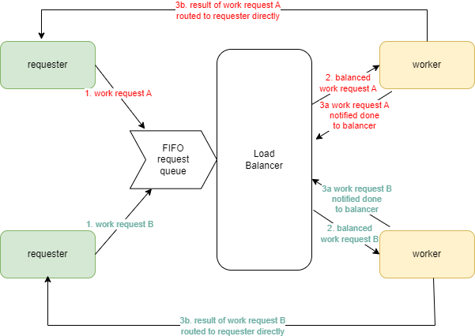

# Concurrent generic load balancer

## Genesis and overview

I was reading about go and was impressed with how it has 3 useful features for concurrent programming:

- `go` routines
- `channel`s (which are typed)
- `select` statement wihc is a concurrent control switch - it give the ability to listen to many channels and wait for any to be ready

I was reading into concurrency as a design approach: Looking at how to construct systens that are composition of independently executing "things" (functions, processes)

I wanted to look at a concurrent design (dealing wit a lot of things at once i.e. structure) as opposed to parallelism (doing many things at once)

Concurrent design leads to independent processed but we have to make pieces and have to make pieces communicate.

I wanted to investigate how to set up a generic concurrent processing architecture. To be concurrent (and not cooperative multitasking),I used the python `multiprocessing.Process` rather than `asyncio` or `multiprocessing.Thread` liobraries.

Also to keep the implementation close to the design without using too many language specific features, `multiprocssing.Pool` is not used. The pool is managed by the `Balancer` to enable load-based balancing.

In this architecture, a variable number of `Requester`s send `Requests` to a single `Balancer` via a single FIFO queue (`multiprocessing.Queue`).

The `Balancer` distributes the incoming requests among a variable number of `Worker`s.

The concurrency is facilitated from an design point of view by

- the work being load balanced among a number of `Worker`s
- the request containing a "return result" queue which enables the `Worker` carrying out the work to communicate the result of the work directly back to the `Requester` - the `Balancer` simply distributes work, it avoids becoming a bottle-neck/creating performance side-effects by **not becoming involved in the relaying of results**.




The important `Queue`s in the design are (following the flow of processing)

1. `Balancer.request_queue` - the queue owned by the `Balancer`, onto which the `Requester`s send their `Requests`

2. `Worker.worker_request_queue` - the queue, owned by the `Worker` instance, onto which the `Balancer` `put`s work to be done

3. `Requester.results_queue` - the queue added to the `Request` to enable the `Worker` to communicate the result of the `Request` **directly** back to the `Requester`
4. `Balancer.work_done_queue` - the queue owned by the `Balancer`, passed to the `Worker` instance on creation which enables the worker to communicate back to the Balancer work done. This enables the `Balancer` to audit work received = work done.

## Features of each class

### `Requester`

The process generating the requests is non-proscriptive: The `Request` simply needs to contain a `Callable` and the arguments to pass to that `Callable` (implemented as `*args`).

This means that any number of heterogenous `Requester`s (work creators) can be attached to the `Balancer` with the condition that the function is stateless first class function.

```python
class Requester:
    def __init__(self, requests_queue, reporting_queue, manager):
        self.requests_queue = requests_queue
        self.results_queue = manager.Queue()
        self.requsts_sent = 0
        self.results_received = 0
        self.sent_all_requests = False
        self.id = uuid4()
        self.reporting_queue = reporting_queue

```

### `Request`

A request object contains 3 fundamental properties

- a python `Callable` to execute, the "work"
- `args` the arguments to be passed to the `Callable`
- `results_queue` - the queue owned by the originating process for the `Worker` that executes the `Request` to send the result back to the `Requester`. The `result` of the work is added to the `Request` instance and the whole request is returned to the `Requester`

```python
class Request:
    def __init__(self, results_queue, reporting_queue, fn, *args):
        self.fn = fn
        self.args = args
        self.results_queue = results_queue
        self.id = uuid4()
        self.reporting_queue = reporting_queue
```

The result is returned to the `Requester` by a call to `Request.evaluate_and_return_result()`

```python
    def evaluate_and_return_result(self):
        self.result = self.fn(*self.args)
        self.results_queue.put(self)
```

### `Worker`

The worker instance is created with its own request queue, onto which the `Balancer` can queue work.

```python
class Worker:
    def __init__(self, manager, reporting_queue):
        self.worker_request_queue = manager.Queue()
        self.requests_received = 0
        self.id = uuid4()
```

The work loop

```python
    def do_work(self):
        loop_for_requests = True
        while loop_for_requests:
            while not self.worker_request_queue.empty():
                req: Request = self.worker_request_queue.get()

                if req == STOP:
                    loop_for_requests = False
                else:
                    self.requests_received += 1
                    req.evaluate_and_return_result()
```

scalable, no locks (FIFO queues)

can parallelise this with more workers, more requesters/work generators but parallel not necessary

can dynamically add (more, more powerful)/remove (costly, redundant) resources

Issues
Workign with Python - not great for parallel, parallelism n ot cheap
Nature of work to be parallelised overhead in
[useful link here](https://stackoverflow.com/a/52076791/10016858)

could replace any queue for a network queue

add pending to worker

add dispatch and completed to balancer
